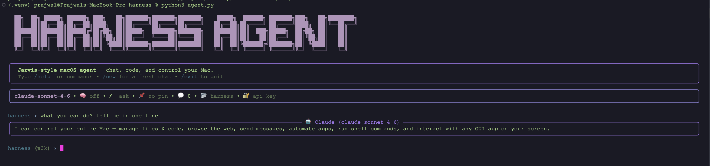

# Harness — Claude Code-style Terminal Agent

A single-file, Claude Code-style terminal agent powered by Anthropic's Claude models. Chat, run tools, edit files, execute shell commands, and control macOS apps from one rich TUI.



## Features

- Interactive REPL with rich rendering (markdown, syntax-highlighted code, panels, spinners)
- Two auth modes: **Anthropic API key** (`sk-ant-…`) or **Claude Pro/Max OAuth** (PKCE flow)
- Built-in tools:
  - File ops: `read_file`, `write_file`, `edit_file`, `list_dir`, `glob_files`, `search_code`
  - Shell: `run_bash`
  - Git: `git_status`, `git_diff`, `git_log`
  - macOS control: launch/focus/quit apps, AppleScript, UI reading, clicks, keystrokes, clipboard, shortcuts, notifications
  - OCR: single-image OCR plus bulk concurrent OCR for folders of screenshots/photos
- Persistent history, notes, pinned context, and command aliases under `~/.config/claude-agent/`
- Cost estimates per session (`/cost`)
- Multiple models supported: `claude-sonnet-4-6` (default), `claude-opus-4-7`, `claude-haiku-4-5`

## Requirements

- Python 3.10+
- macOS (for the mac-control tools; core agent works anywhere)
- An Anthropic API key **or** a Claude Pro/Max subscription

## Install

```bash
git clone <this-repo> harness
cd harness
python3 -m venv .venv
source .venv/bin/activate
pip install -r requirements.txt
```

## Usage

```bash
python agent.py
```

On first run you'll be prompted to choose an auth mode:

- **API key** — paste an `sk-ant-…` key; stored at `~/.config/claude-agent/key` (chmod 600)
- **OAuth** — sign in with your Claude Pro/Max account via browser + PKCE

### Environment variables

- `ANTHROPIC_API_KEY` — use this key instead of the stored one
- `CLAUDE_MODEL` — override the default model (e.g. `claude-opus-4-7`)
- `HARNESS_MAX_PARALLEL_TOOLS` — max concurrent independent tool workers, default `64`, capped at `64`

### Useful slash commands

- `/help` — list commands
- `/model <name>` — switch model
- `/verbose` — show or hide internal thinking/tool traces
- `/cost` — session token + USD estimate
- `/clear` — reset conversation
- `/logout` — clear saved credentials

### Images

- Drag an image file into the prompt to OCR it and include it in your message.
- Copy an image to the macOS clipboard, then type your prompt normally and press Enter; the agent OCRs the fresh clipboard image and attaches it to that same message.
- `/paste <optional prompt>` also works with clipboard images.

## Project layout

```
harness/
├── agent.py          # the entire agent
├── requirements.txt
└── assets/
    └── agent.png
```

## Notes

- macOS UI-control tools require Accessibility and Automation permissions (System Settings → Privacy & Security).
- All credentials and state live under `~/.config/claude-agent/`.
