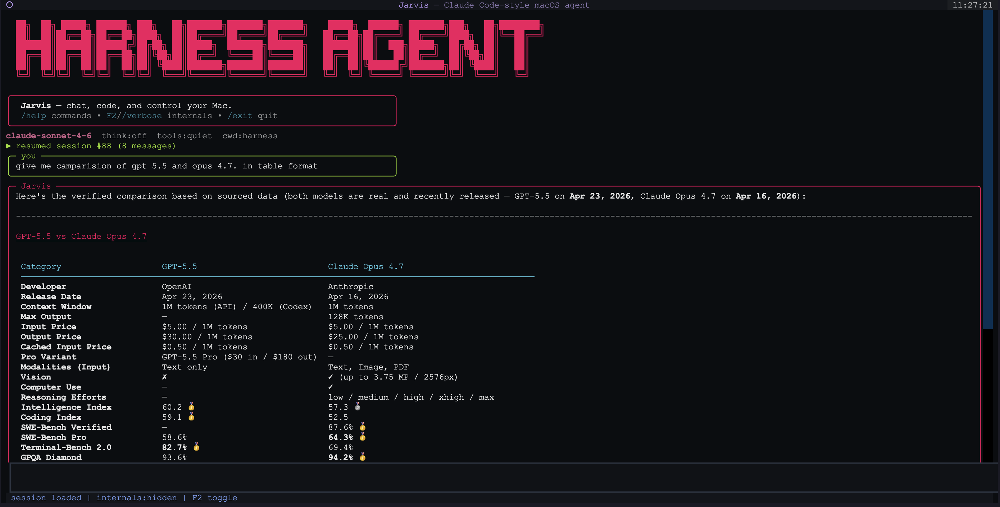

<div align="center">
  
  <h1>Harness — Jarvis Terminal Agent</h1>
  <p>
    <strong>AI coding agent for your terminal.</strong><br/>
    Chat, run tools, edit files, execute shell commands, and control macOS — all from one TUI.
  </p>

  <p>
    
    
    
    
  </p>
</div>

---

## ✨ Overview

Harness is a **terminal-native AI agent** powered by Anthropic's Claude. You talk to it, it uses tools — reads/writes files, runs shell commands, searches code, uses git, controls macOS apps, OCRs images, browses the web — and gets work done right where your code lives.

> **No web UI, no daemon.** Just `jarvis` in your project folder.

---

## 🚀 Quick Start

```bash
curl -fsSL https://raw.githubusercontent.com/PrajsRamteke/harness-agent/main/scripts/install | bash
jarvis
```

That's it. You'll be prompted to pick an auth method on first run.

---

## 🖼️ Screenshots

<table>
  <tr>
    <td></td>
    <td></td>
  </tr>
</table>

---

## 📋 Table of Contents

- [Features](#-features)
- [Requirements](#-requirements)
- [Installation](#-installation)
- [Usage](#-usage)
- [Slash Commands](#-slash-commands)
- [Environment Variables](#-environment-variables)
- [Project Layout](#-project-layout)
- [Notes](#-notes)

---

## 🧰 Features

<table>
  <tr>
    <td width="50%">
      <h4>💬 Interactive TUI</h4>
      <p>Rich terminal UI with markdown rendering, syntax-highlighted code, panels, and streaming responses.</p>
    </td>
    <td width="50%">
      <h4>🔐 Dual Auth</h4>
      <p>Use an <strong>Anthropic API key</strong> (sk-ant-…) or sign in with <strong>Claude Pro/Max OAuth</strong> via PKCE.</p>
    </td>
  </tr>
  <tr>
    <td>
      <h4>📁 File Operations</h4>
      <p>Read, write, edit files. List directories, glob patterns, rank files by relevance, search code with ripgrep.</p>
    </td>
    <td>
      <h4>🐚 Shell Access</h4>
      <p>Run any shell command, view output inline — no context switching.</p>
    </td>
  </tr>
  <tr>
    <td>
      <h4>⎇ Git Integration</h4>
      <p>Status, diff, log — all from the chat. No need to tab out.</p>
    </td>
    <td>
      <h4>🖥️ macOS Control</h4>
      <p>Launch/focus/quit apps, click UI elements, type text, run AppleScript, use keyboard shortcuts, clipboard, notifications.</p>
    </td>
  </tr>
  <tr>
    <td>
      <h4>🌐 Web Access</h4>
      <p>Search the web and fetch URLs. Verified search cross-checks multiple sources for factual answers.</p>
    </td>
    <td>
      <h4>🧠 Persistent Memory</h4>
      <p>Remembers facts about you across sessions. Stores skills, notes, and aliases under <code>~/.config/claude-agent/</code>.</p>
    </td>
  </tr>
  <tr>
    <td>
      <h4>📊 Cost Tracking</h4>
      <p><code>/cost</code> shows token usage and estimated USD spend per session.</p>
    </td>
    <td>
      <h4>🔌 MCP Support</h4>
      <p>Model Context Protocol — connect external tools and data sources.</p>
    </td>
  </tr>
  <tr>
    <td>
      <h4>🎨 Themes</h4>
      <p>Built-in <strong>red</strong> and <strong>purple</strong> themes. Easily extensible.</p>
    </td>
    <td></td>
  </tr>
</table>

---

## ✅ Requirements

- **Python 3.10+** — If your system Python is older, install a newer one:
  ```bash
  brew install python@3.11
  ```
- **macOS** — required for macOS control features. Core agent works on any platform.
- **Anthropic API key** or a **Claude Pro/Max subscription**

---

## 📦 Installation

### One-command install (recommended)

```bash
curl -fsSL https://raw.githubusercontent.com/PrajsRamteke/harness-agent/main/scripts/install | bash
```

After install, open a **new terminal**, go to any project, and run:

```bash
jarvis
```

<details>
<summary><strong>Troubleshooting: "command not found: jarvis"</strong></summary>

If your shell can't find `jarvis`, add `~/.local/bin` to your PATH:

```bash
export PATH="$HOME/.local/bin:$PATH"
jarvis
```

Add that line to your `~/.zshrc` to make it permanent.
</details>

### Development setup

```bash
git clone https://github.com/PrajsRamteke/harness-agent.git
cd harness-agent
python3 -m venv .venv
source .venv/bin/activate
pip install -e .
```

Then run:

```bash
jarvis        # TUI mode (default)
# or
python agent.py --legacy   # Rich REPL mode
```

---

## 🎮 Usage

```bash
jarvis
```

Run it from the **folder you want it to work in**. The status bar shows the current project path — all file operations, code searches, and shell commands are scoped to that directory.

### First run

On first launch, you'll pick how to authenticate:

| Option | How it works |
|---|---|
| **API key** | Paste an `sk-ant-…` key. Saved at `~/.config/claude-agent/key` (permissions: 600) |
| **OAuth** | Opens your browser to sign in with your Claude Pro/Max account via PKCE |

### ⌨️ Slash Commands

| Command | What it does |
|---|---|
| `/help` | List all commands |
| `/model <name>` | Switch models (e.g. `claude-opus-4-7`, `claude-haiku-4-5`) |
| `/verbose` / `F2` | Toggle internal thinking and tool traces (shown by default) |
| `/cost` | Show token usage + estimated USD cost |
| `/clear` | Reset the conversation |
| `/logout` | Clear saved credentials |
| `/theme` | Switch themes |

---

## ⚙️ Environment Variables

| Variable | What it does | Default |
|---|---|---|
| `ANTHROPIC_API_KEY` | Use this key instead of the stored one | — |
| `CLAUDE_MODEL` | Override the default model | `claude-sonnet-4-6` |
| `HARNESS_MAX_PARALLEL_TOOLS` | Max concurrent tool workers | `64` (capped) |
| `HARNESS_HTTP_READ_TIMEOUT` | Streaming response timeout (s) | `240` (OpenRouter), `600` (Anthropic) |
| `HARNESS_HTTP_CONNECT_TIMEOUT` | Connection timeout (s) | `30` |
| `HARNESS_STREAM_REPLY` | Set to `0` to disable live streaming | `1` |

---

## 🗂️ Project Layout

```
harness/
├── agent.py                # Entry point (routes to TUI or REPL)
├── pyproject.toml          # Package config
├── requirements.txt
├── CLAUDE.md               # Context for AI coding assistants
├── JARVIS.md
│
├── jarvis/                 # Main package
│   ├── __main__.py         # `python -m jarvis`
│   ├── cli.py              # CLI entry point
│   ├── main.py             # Core send-and-loop logic
│   ├── state.py            # Module-level shared state
│   │
│   ├── auth/               # Authentication
│   │   ├── client.py       # Unified client factory
│   │   ├── api_key.py      # API key handling
│   │   ├── oauth_flow.py   # OAuth PKCE flow
│   │   ├── pkce.py         # PKCE utilities
│   │   ├── openrouter.py   # OpenRouter support
│   │   └── opencode.py     # OpenCode adapter
│   │
│   ├── tools/              # Tool implementations
│   │   ├── router.py       # Dynamic tool selection
│   │   ├── schemas_core.py # Core tool schemas
│   │   ├── schemas_mac.py  # macOS tool schemas
│   │   ├── mac/            # macOS control
│   │   └── web/            # Web fetch & search
│   │
│   ├── repl/               # Response handling
│   │   ├── stream.py       # Stream processing
│   │   ├── render.py       # Tool execution + rendering
│   │   ├── hallucination.py
│   │   └── trim.py         # Context trimming
│   │
│   ├── tui/                # Textual TUI
│   │   └── app.py          # Terminal UI app
│   │
│   ├── commands/           # Slash commands
│   │   └── dispatch.py
│   │
│   ├── storage/            # Persistence
│   │   ├── sessions.py     # SQLite session history
│   │   ├── memory.py       # User memory
│   │   ├── skills.py       # Learned skills
│   │   └── prefs.py        # Preferences
│   │
│   ├── mcp/                # MCP server management
│   │   ├── config.py
│   │   ├── registry.py
│   │   └── manager.py
│   │
│   ├── constants/          # Paths, models, prompts
│   └── utils/
│
├── scripts/                # Install scripts
├── assets/                 # Screenshots
└── tests/                  # (empty — manual testing)
```

---

## 📝 Notes

- **macOS permissions** — UI control tools need **Accessibility** and **Automation** permissions. Enable them in: System Settings → Privacy & Security → Accessibility / Automation.
- **Credentials** — All config, keys, and history live under `~/.config/claude-agent/`.
- **Tool selection is dynamic** — Harness only sends the schemas for tools it thinks you'll need, keeping context lean. Core file/code tools are always included; macOS, web, OCR tools are loaded on demand.
- **Project context** — Drop a `CLAUDE.md` or `JARVIS.md` in your project root, and the agent reads it automatically for project-specific instructions.

---

<div align="center">
  <p>Built with ❤️ by <a href="https://github.com/PrajsRamteke">Prajwal Ramteke</a></p>
  <p>
    <a href="https://github.com/PrajsRamteke/harness-agent">GitHub</a> ·
    <a href="https://github.com/PrajsRamteke/harness-agent/issues">Issues</a> ·
    <a href="https://github.com/PrajsRamteke/harness-agent/discussions">Discussions</a>
  </p>
</div>
